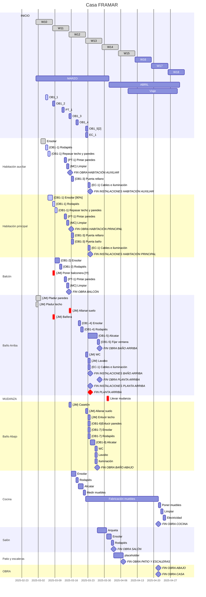

- {OB1} = Francisco, el de wallapop
- {JM} = Josema
- {MC} = Marcos
- {PT} = Pintor
- {EC} = Electricista (Probablemente Josema)

```mermaid
gantt

title Casa FRAMAR

dateFormat DD/MM/YY

INICIO                              :INICIO, 22/02/25,0d

W10                                 :done,  W10, 01/03/25, 7d
W11                                 :done,  W11, 08/03/25, 7d
W12                                 :done,  W12, 15/03/25, 7d
W13                                 :done,  W13, 22/03/25, 7d
W14                                 :done,  W14, 29/03/25, 7d
W15                                 :done,  W15, 05/04/25, 7d
W16                                 :       W16, 12/04/25, 7d
W17                                 :       W17, 19/04/25, 7d
W18                                 :       W18, 26/04/25, 7d

MARZO                               :       MARZO, 01/03/25, 31d
ABRIL                               :       ABRIL, 01/04/25, 30d
Viaje                               :       VIAJE, 09/04/25, 21d

OB1_1                               :active,OB1_1, 05/03/25, 1d
OB1_2                               :       OB1_2, after W10, 1d
PT_1                                :       PT_1, after HB2, 1d
OB1_3                               :       OB1_3, after W11, 1d
OB1_4                               :       OB1_4, 18/03/25, 1d
OB1_5[2]                            :       OB1_5, after W12, 1d
EC_1                                :       EC_1, after W12, 1d

section Habitación auxiliar
    Ensolar                         :done,  HA1, 03/03/2025, 2d
    {OB1-1} Rodapiés                        :active,HA2, after HA1, 0.5d
    {OB1-1} Repasar techo y paredes         :active,HA3, after HA2, 0.5d
    {PT-1} Pintar paredes                  :       HA4, after PT_1, 1d
    {MC} Limpiar                         :       HA5, after HA4, 0.5d
    FIN OBRA HABITACIÓN AUXILIAR    :milestone, HAFIN, after HA1 HA2 HA3 HA4 HA5, 1d

    {OB1-3} Puerta rellano                  :       HA_I2, after OB1_3, 0.5d
    {EC-1} Cables e iluminación            :       HA_I1, after EC_1, 0.5d
    FIN INSTALACIONES HABITACIÓN AUXILIAR :milestone, HAIFIN, after HA_I1 HA_I2, 0d


section Habitación principal 
    {OB1-1} Ensolar [90%]                   :active,HP1, after OB1_1, 2d
    {OB1-1} Rodapiés                        :active,HP2, after HP1, 0.5d
    {OB1-1} Repasar techo y paredes         :active,HP3, after HP2, 0.5d
    {PT-1} Pintar paredes                  :     HP4, after PT_1, 0.5d
    {MC} Limpiar                         :       HP5, after HP4, 0.5d
    FIN OBRA HABITACIÓN PRINCIPAL   :milestone, HPFIN, after HAFIN, 0d

    {OB1-3} Puerta rellano                  :       HP_I2, after OB1_3, 0.5d
    {OB1-3} Puerta baño                     :       HP_I3, after OB1_3, 0.5d
    {EC-1} Cables e iluminación            :       HP_I1, after EC_1, 0.5d
    FIN INSTALACIONES HABITACIÓN PRINCIPAL :milestone, HPIFIN, after HP_I1 HP_I2 HP_I3, 0d

section Balcón
    {OB1-2} Ensolar                      :       HB1, after OB1_2, 2d
    {OB1-2} Rodapiés                     :       HB2, after HB1, 1d
    {JM} Poner balconera [!!!]           :crit,  HB6, after W10, 0.5d
    {PT-1} Pintar paredes                  :     HB4, after PT_1, 0.5d
    {MC} Limpiar                         :       HB5, after HB4, 0.5d
    FIN OBRA BALCÓN                 :milestone, HBFIN, after HB1 HB2 HB4 HB5, 0d

section Baño Arriba
    {JM} Pladur paredes             :done,  BA1, 03/01/2025, 2d
    {JM} Pladur techo               :done,  BA2, 03/01/2025, 1d
    {JM} Allanar suelo              :crit,  BA3, after W11, 1d
    {JM} Bañera                     :crit,  BA9, after W10, 1d
    {OB1-4} Ensolar                 :       BA4, after OB1_4, 1d
    {OB1-4} Rodapiés                :       BA5, after BA4, 1d
    {OB1-5} Alicatar                :       BA6, after OB1_5, 4d
    {OB1-5} Fijar ventana              :       BA7, after BA6, 0.5d
    FIN OBRA BAÑO ARRIBA            :milestone, BAFIN, after BA1 BA2 BA3 BA4 BA5 BA6 BA7, 0d
    {JM} WC                         :       BA_I1, after W12, 0.5d
    {JM} Lavabo                     :       BA_I2, after BA_I1, 0.5d
    {EC-1} Cables e iluminación     :       BA_I3, after EC_1, 1d
    FIN INSTALACIONES BAÑO ARRIBA  :milestone, BAIFIN, after BA_I1 BA_I2 BA_I3, 0d
    
    FIN OBRA PLANTA ARRIBA          :milestone , AAFIN, after HAFIN BAFIN HPFIN, 0d
    FIN INSTALACIONES PLANTA ARRIBA :milestone , AAFIN, after HAIFIN BAIFIN HPIFIN, 0d

    FIN PLANTA ARRIBA              :milestone, crit , PAFIN, after AAFIN, 0d

section MUDANZA
    Llevar mudanza                      :crit,  HAMUD, 03/31/2025, 1d

section Baño Abajo
    {JM} Casetón                    :       BJ1, after W11, 1d
    {JM} Allanar suelo              :       BJ2, after W12, 1d
    {JM} Enlucir techo              :       BJ3, after BJ2, 1d
    {OB1-6}Enlucir paredes          :       BJ4, after BJ2, 1d
    {OB1-7} Ensolar                 :       BJ5, after BJ2, 1d
    {OB1-7} Rodapiés                :       BJ6, after BJ2, 1d
    {OB1-8} Alicatar                :       BJ7, after BJ5, 2d
    WC                              :       BJ8, after BJ7, 0.5d
    Lavabo                          :       BJ9, after BJ7, 0.5d
    Iluminación                     :       BJ11, after BJ7, 1d
    FIN OBRA BAÑO ABAJO             :milestone, BJFIN, after BJ11, 0d

section Cocina
    Ensolar                         :       CC1, after BJ1, 2d
    Rodapiés                        :       CC2, after CC1, 1d
    Alicatar                        :       CC4, after CC2, 2d
    Medir muebles                   :       CC7, after CC4, 0.5d
    Fabricación muebles             :       CC8, after CC7, 1M
    Poner muebles                   :       CC9, after CC8, 1d
    Limpiar                         :       CC5, after CC9, 0.5d
    Electricidad                    :       CC6, after CC5, 1d
    FIN OBRA COCINA                 :milestone, CCFIN, after CC8, 0d

section Salón
    Arqueta                         :       SL1, after BJFIN, 4d
    Ensolar                         :       SL2, after SL1, 2d
    Rodapiés                        :       SL3, after SL2, 1d
    FIN OBRA SALÓN                  :milestone, SLFIN, after SL3, 0d

section Patio y escaleras
    placeholder                     :       PH4, after SLFIN, 4d
    FIN OBRA PATIO Y ESCALERAS      :milestone, PHFIN, after PH4, 0d

section OBRA
    FIN OBRA ABAJO                  :milestone, ABFIN, after BJFIN CCFIN SLFIN PHFIN, 0d
    FIN OBRA CASA                       :milestone, FINOBRA , after AAFIN ABFIN, 0d


```