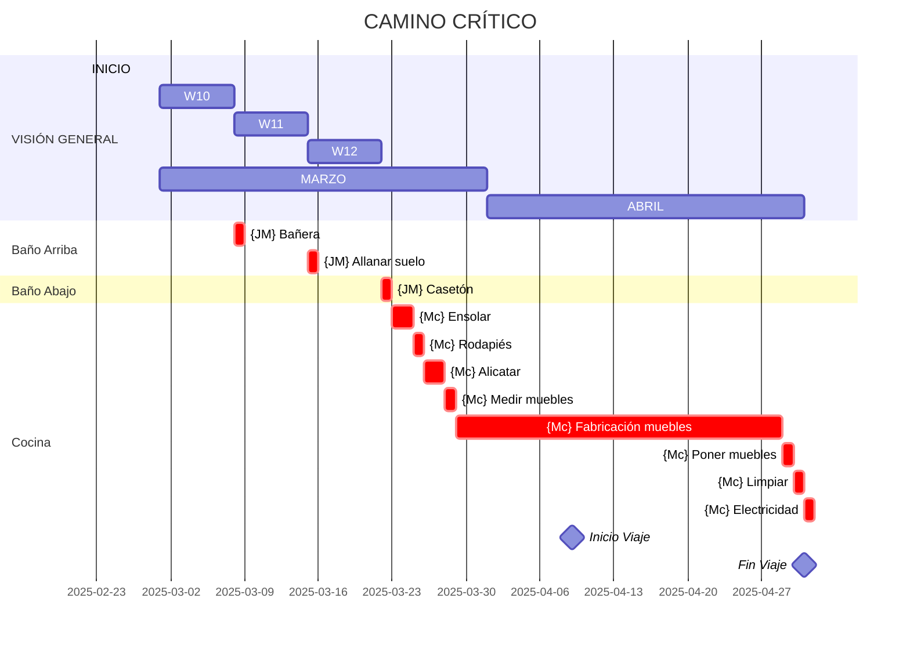

- {OB1} = Francisco, el de wallapop
- {JM} = Josema
- {MK} = Marcos
- {Mc} = Macario
- {PT} = Pintor

```mermaid

gantt

title Casa FRAMAR

dateFormat DD/MM/YY

section VISIÓN GENERAL
    
    


    INICIO                              :INICIO, 22/02/25,0d

    W10                                 :done,  W10, 01/03/25, 7d
    W11                                 :done,  W11, 08/03/25, 7d
    W12                                 :done,  W12, 15/03/25, 7d
    W13                                 :done,  W13, 22/03/25, 7d
    W14                                 :done,  W14, 29/03/25, 7d
    W15                                 :done,  W15, 05/04/25, 7d
    W16                                 :       W16, 12/04/25, 7d
    W17                                 :       W17, 19/04/25, 7d
    W18                                 :       W18, 26/04/25, 7d

    MARZO                               :       MARZO, 01/03/25, 31d
    ABRIL                               :       ABRIL, 01/04/25, 30d


    FIN OBRA BAÑO ARRIBA            :milestone, BAFIN, after BA1 BA2 BA3 BA4 BA5 BA6 BA7, 0d
    FIN OBRA COCINA                 :crit, milestone, CCFIN, after CC3, 0d
    FIN OBRA BALCÓN                 :milestone,  HBFIN, after HB1 HB2 HB4 HB5, 0d

    FIN OBRA HABITACIÓN PRINCIPAL   :milestone, HPFIN, after HP1 HP2 HP3 HP4 HP5, 0d
    FIN OBRA HABITACIÓN AUXILIAR    :milestone, HAFIN, after HA1 HA2 HA3 HA4 HA5, 1d
    FIN OBRA PLANTA ARRIBA          :milestone , AAFIN, after HBFIN HPFIN BAFIN HAFIN, 0d
    
    FIN INSTALACIONES HABITACIÓN PRINCIPAL :milestone, HPIFIN, after HP_I1 HP_I2 HP_I3, 0d
    FIN INSTALACIONES HABITACIÓN AUXILIAR :milestone, HAIFIN, after HA_I1 HA_I2, 0d
    FIN INSTALACIONES BAÑO ARRIBA  :milestone, BAIFIN, after BA_I1 BA_I2 BA_I3, 0d
    FIN INSTALACIONES PLANTA ARRIBA :milestone , AAIFIN, after HPIFIN HAIFIN BAIFIN, 0d
    FIN PLANTA ARRIBA              :milestone, PAFIN, after AAFIN AAIFIN, 0d

    Se puede llevar mudanza                      :milestone,  HAMUD, after HPFIN HBFIN HAFIN HPIFIN HAIFIN BAIFIN, 1d
    Mudanza                     :MUD, after HAMUD, 7d
    FIN OBRA BAÑO ABAJO             :milestone, BJFIN, after BJ11, 0d

    Inicio Viaje                        :milestone, crit, VIAJESTART, 09/04/25, 0d
    FIN OBRA SALÓN                  :milestone, SLFIN, after SL3, 0d
    FIN OBRA PATIO Y ESCALERAS      :milestone, PHFIN, after PH4, 0d
    Fin Viaje                        :milestone, crit, VIAJESTART, 01/05/25, 0d
    FIN INSTALACIÓN COCINA          :milestone, crit, CCIFIN, after CC4 CC5 CC6 CC7 CC8, 0d
    FIN OBRA ABAJO                  :milestone, crit, ABFIN, after BJFIN CCFIN CCIFIN SLFIN PHFIN, 0d
    FIN OBRA CASA                   :milestone, crit, FINOBRA , after PAFIN ABFIN , 0d


    OB1_1                               :done,OB1_1, 05/03/25, 1d
    OB1_2                               :       OB1_2, after W10, 1d
    OB1_3[2]                            :       OB1_3, after W11, 1d
    OB1_4                               :       OB1_4, after BAFIN, 1d
    PT_1                                :       PT_1, after HB2 BA5 HP2 HA2, 1d
    EC_1                                :       EC_1, after W13 HAFIN HPFIN HBFIN BAFIN, 1d


section Habitación auxiliar
    Ensolar                         :done,  HA1, 03/03/2025, 2d
    {OB1-1} Rodapiés                :done,HA2, after HA1, 0.5d
    {OB1-1} Repasar techo y paredes :done,HA3, after HA2, 0.5d
    {PT-1} Pintar paredes           :       HA4, after PT_1, 1d
    {MK} Limpiar                    :       HA5, after HA4, 0.5d

    {OB1-3} Puerta rellano          :       HA_I2, after OB1_4, 0.5d
    {JM} Cables e iluminación       :       HA_I1, after EC_1, 0.5d

section Habitación principal 
    {OB1-1} Ensolar [90%]           :done,HP1, after OB1_1, 2d
    {OB1-1} Rodapiés                :done,HP2, after HP1, 0.5d
    {OB1-1} Repasar techo y paredes :done,HP3, after HP2, 0.5d
    {PT-1} Pintar paredes           :     HP4, after PT_1, 0.5d
    {MK} Limpiar                    :       HP5, after HP4, 0.5d

    {OB1-3} Puerta rellano          :       HP_I2, after OB1_4, 0.5d
    {OB1-3} Puerta baño             :       HP_I3, after OB1_4, 0.5d
    {JM} Cables e iluminación       :       HP_I1, after EC_1, 0.5d

section Balcón
    {JM} Poner balconera            :   HB6, after W11, 0.5d
    {OB1-3} Ensolar                 :        HB1, after HB6 OB1_4, 2d
    {OB1-3} Rodapiés                :        HB2, after HB1 OB1_4, 1d
    {PT-1} Pintar paredes           :      HB4, after PT_1, 0.5d
    {MK} Limpiar                    :        HB5, after HB4, 0.5d

section Baño Arriba
    {JM} Pladur paredes             :done,  BA1, 03/01/2025, 2d
    {JM} Pladur techo               :done,  BA2, 03/01/2025, 1d
    {JM} Bañera                     :crit,   BA9, after W10, 1d
    {JM} Allanar suelo              :crit,   BA3, after W11 BA9, 1d
    {OB1-2} Ensolar                 :       BA4, after OB1_2 BA3, 1d
    {OB1-2} Rodapiés                :       BA5, after BA4, 1d
    {OB1-4} Alicatar                :       BA6, after OB1_3 BA5, 4d
    {OB1-4} Fijar ventana           :       BA7, after BA6, 0.5d
    {JM} WC                         :  BA_I1, after W12 BA4, 0.5d
    {JM} Lavabo                     :  BA_I2, after BA_I1 BA4, 0.5d
    {JM} Cables e iluminación       :       BA_I3, after EC_1 BAFIN, 1d
    
section Baño Abajo
    {JM} Casetón                    :crit,        BJ1, after W12, 1d
    {Mc} Allanar suelo              :       BJ2, after CC4, 2d
    {Mc} Enlucir techo              :       BJ3, after BJ2, 0.5d
    {Mc}Enlucir paredes             :       BJ4, after BJ3, 0.5d
    {Mc} Ensolar                    :       BJ5, after BJ4, 0.5d
    {Mc} Rodapiés                   :       BJ6, after BJ5, 0.5d
    {Mc} Alicatar                   :       BJ7, after BJ6, 2d
    {Mc} WC                         :       BJ8, after BJ7, 0.5d
    {Mc} Lavabo                     :       BJ9, after BJ7, 0.5d
    {Mc} Iluminación                :       BJ11, after BJ7, 0.5d

section Salón
    {Mc} Arqueta                    :       SL1, after BJFIN, 4d
    {Mc} Ensolar                    :       SL2, after SL1, 2d
    {Mc} Rodapiés                   :       SL3, after SL2, 1d

section Patio y escaleras
    {Mc} placeholder                :       PH4, after SLFIN, 1w

section Cocina
    {Mc} Ensolar                    :crit,        CC1, after BJ1, 2d
    {Mc} Rodapiés                   :crit,        CC2, after CC1, 1d
    {Mc} Alicatar                   :crit,        CC3, after CC2, 2d
    {Mc} Medir muebles              :crit,        CC4, after CC3, 0.5d
    {Mc} Fabricación muebles        :crit,        CC5, after CC4, 1M
    {Mc} Poner muebles              :crit,        CC6, after CC5, 1d
    {Mc} Limpiar                    :crit,        CC7, after CC6, 0.5d
    {Mc} Electricidad               :crit,        CC8, after CC7, 1d

```

```mermaid

gantt

title CAMINO CRÍTICO

dateFormat DD/MM/YY

section VISIÓN GENERAL
    
    INICIO                              :INICIO, 22/02/25,0d

    W10                                 :W10, 01/03/25, 7d
    W11                                 :W11, 08/03/25, 7d
    W12                                 :W12, 15/03/25, 7d
    MARZO                               :MARZO, 01/03/25, 31d
    ABRIL                               :ABRIL, 01/04/25, 30d


section Baño Arriba
    {JM} Bañera                     :crit,   BA9, after W10, 1d
    {JM} Allanar suelo              :crit,   BA3, after W11 BA9, 1d
    
section Baño Abajo
    {JM} Casetón                    :crit,        BJ1, after W12, 1d

section Cocina
    {Mc} Ensolar                    :crit,        CC1, after BJ1, 2d
    {Mc} Rodapiés                   :crit,        CC2, after CC1, 1d
    {Mc} Alicatar                   :crit,        CC3, after CC2, 2d
    {Mc} Medir muebles              :crit,        CC4, after CC3, 0.5d
    {Mc} Fabricación muebles        :crit,        CC5, after CC4, 1M
    {Mc} Poner muebles              :crit,        CC6, after CC5, 1d
    {Mc} Limpiar                    :crit,        CC7, after CC6, 0.5d
    {Mc} Electricidad               :crit,        CC8, after CC7, 1d
    Inicio Viaje                        :milestone, VIAJESTART, 09/04/25, 0d
    Fin Viaje                        :milestone, VIAJEND, 01/05/25, 0d

```
